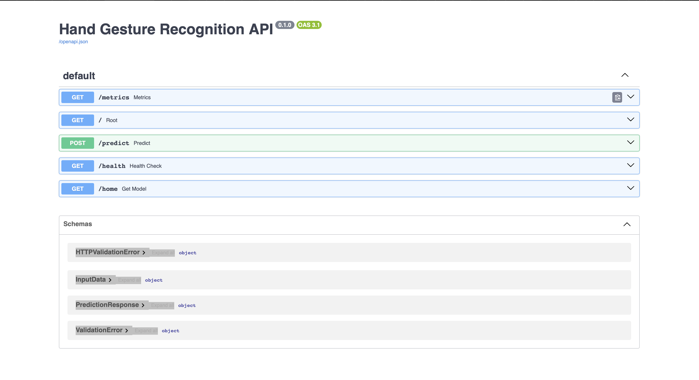

# ✋ Hand Gesture Recognition API

This project provides a containerized REST API for real-time hand gesture recognition using a pre-trained machine learning model. It is built using **FastAPI** and supports monitoring through **Prometheus** and **Grafana**.

---

## 🧠 Project Overview

- **Framework**: FastAPI  
- **Model**: Random Forest classifier  
- **Monitoring**: Prometheus + Grafana  
- **Containerization**: Docker + Docker Compose  

---

## 📦 Features

- Predict hand gestures based on 63 float features.
- Modular API code structure.
- Real-time monitoring of inference time and errors.
- Live dashboards with Grafana.
- Easy local deployment with Docker Compose.

---

## 🧪 API Usage

### 📍 Endpoint

``` bash
POST /predict
```

### 🔧 Request Body

```json
{
  "features": [0.1, 0.2, ..., 0.63]
}
```

### ✅ Response

```json
{
  "predicted_class": 3
}
```

---

## 🧬 API Documentation

FastAPI provides built-in Swagger UI at:

📎 [http://localhost:8000/docs](http://localhost:8000/docs)

📷 **Swagger UI Screenshot**  


---

## 📈 Metrics & Monitoring

### 📊 Metrics Tracked

| Metric Name                    | Type      | Description                                       |
|-------------------------------|-----------|---------------------------------------------------|
| `inference_duration_seconds`  | Summary   | Measures inference time for predictions           |
| `input_feature_length_errors` | Counter   | Counts malformed inputs (length ≠ 63)             |
| `http_request_duration_seconds` | Histogram | Total server request duration via Prometheus FastAPI Instrumentator |

### 🔭 Prometheus

Accessible at:  
📎 [http://localhost:9090](http://localhost:9090)

### 📉 Grafana

Accessible at:  
📎 [http://localhost:3000](http://localhost:3000)  
Login: `admin` / `admin`

📷 **Grafana Dashboard Screenshot**  


---

## 🚀 Quick Start

### 1️⃣ Clone the repo

```bash
git clone https://github.com/your-username/gesture-backend.git
cd gesture-backend
```

### 2️⃣ Run the app with Docker Compose

```bash
docker-compose up --build
```

Wait until all services are up. Then open:

- API: [http://localhost:8000](http://localhost:8000)
- Docs: [http://localhost:8000/docs](http://localhost:8000/docs)
- Prometheus: [http://localhost:9090](http://localhost:9090)
- Grafana: [http://localhost:3000](http://localhost:3000)

---

## 🧾 Metrics Selection Justification

### ✅ Model-Related: `inference_duration_seconds`

- Measures how long model inference takes.
- Helps identify performance bottlenecks.

### ✅ Data-Related: `input_feature_length_errors`

- Detects malformed input data (e.g., feature vector of wrong length).
- Helps catch client-side bugs or broken preprocessing.

### ✅ Server-Related: `http_request_duration_seconds`

- Captures total time taken per API request.
- Useful for understanding server responsiveness under load.

---

## 🛠️ Development Structure

```bash
gesture-backend/
│── main.py                              
│── model/RandomForest_model.pkl
│── preprocess_landmark.py
├── Dockerfile
├── docker-compose.yml
├── prometheus.yml
├── requirements.txt
├── README.md
└── docs/
    ├── swagger_ui.png            
    └── grafana_dashboard.png   
```